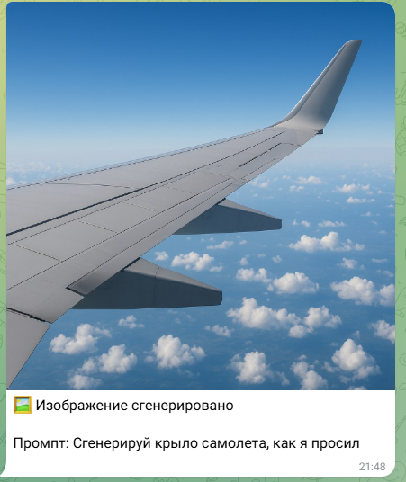
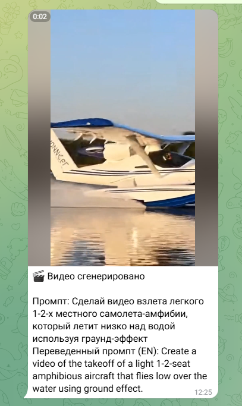
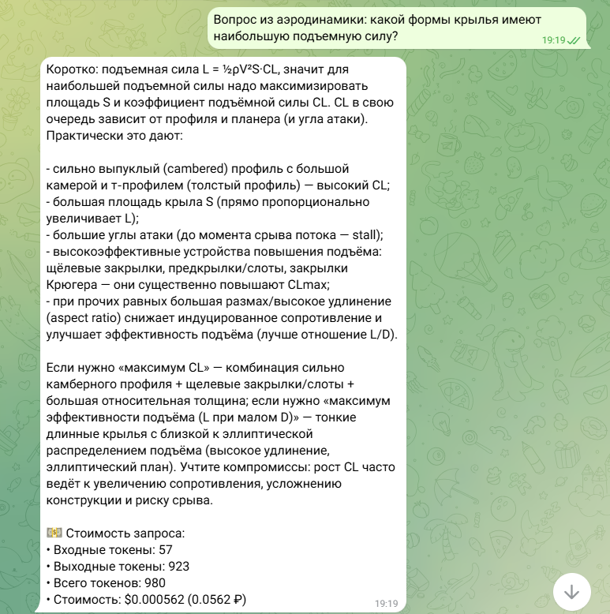

# AI MULTIBOT Telegram

Telegram-бот с интеграцией OpenAI (через ProxyAPI): генерация текста, изображений и видео, несколько режимов работы и контекстная память диалогов. Проект оформлен как портфолио-кейс.

## Задача

Универсальный AI-бот для Telegram с единой точкой входа: ответы на вопросы (LLM), генерация картинок и видео по описанию, переключение режимов (помощник, разработчик, писатель, учитель, аналитик, генераторы медиа) и учёт стоимости запросов в USD/RUB.

## Возможности

- 💬 Текстовые ответы с использованием LLM (GPT-4o-mini)
- 🖼️ Генерация изображений через `gpt-image-1-mini`
- 🎬 Генерация видео через `sora-2`
- 🧠 Контекстная память диалогов
- ⚙️ Переключение режимов работы (7 режимов)
- 💵 Отслеживание стоимости запросов в USD и RUB
- 📊 Логирование всех операций

## Стек технологий

- Python 3.10+
- **aiogram 3.x** — Telegram Bot API
- **OpenAI Python SDK** — работа с OpenAI API через ProxyAPI
- **python-dotenv** — переменные окружения
- **aiohttp** — асинхронные HTTP-запросы (курс ЦБ РФ)

## Установка и запуск

1. Клонируйте репозиторий:
```bash
git clone https://github.com/Alexgrig77/AI_MULTIBOT_Telegramm.git
cd AI_MULTIBOT_Telegramm
```

2. Создайте виртуальное окружение и установите зависимости:
```bash
python -m venv venv
.\venv\Scripts\activate
pip install -r requirements.txt
```

3. Создайте `.env` на основе `.env.example` и заполните ключи:
```bash
copy .env.example .env
```
```
BOT_TOKEN=your_telegram_bot_token
PROXYAPI_BASE_URL=https://api.proxyapi.ru/openai/v1
OPENAI_API_KEY=your_proxyapi_key
OPENAI_MODEL=gpt-4o-mini
IMAGE_MODEL=gpt-image-1-mini
VIDEO_MODEL=sora-2
LOG_LEVEL=INFO
```

4. Запуск:
```bash
python main.py
```

## Команды бота

| Команда | Описание |
|--------|----------|
| `/start` | Запуск бота и главное меню |
| `/mode` | Выбор режима работы |
| `/reset` | Очистка истории диалога |
| `/image <описание>` | Генерация изображения по тексту |
| `/video <описание>` | Генерация видео по тексту |

В режимах «Генератор изображений» и «Генератор видео» можно просто писать описание текстом — бот сгенерирует медиа без команды.

## Режимы работы

1. **Обычный помощник** — повседневные задачи  
2. **Помощник разработчика** — код и объяснения  
3. **Редактор текстов** — статьи, посты, описания  
4. **Учитель** — объяснения простым языком  
5. **Аналитик** — анализ данных и решений  
6. **Генератор изображений** — генерация картинок по тексту  
7. **Генератор видео** — генерация видео по тексту  

## Скриншоты

|  |  |  |
|:---:|:---:|:---:|
| Меню и команды бота | Ответ ассистента (LLM) | Генерация изображения |

## Структура проекта

```
AI_MULTIBOT_Telegramm/
├── main.py              # Точка входа, хендлеры, вызовы API
├── config.py            # Конфигурация из .env
├── memory.py            # Память диалогов (по user_id)
├── prompts.json         # Системные промпты режимов
├── requirements.txt
├── .env.example
├── .gitignore
└── docs/
    ├── Screenshot1.png, Screenshot2.png, Screenshot3.png
    └── TODO.md
```

## Доступ

- **Код:** данный репозиторий (открытый).
- **Бот в Telegram:** запускается локально или на сервере по вашему `BOT_TOKEN`; ссылку на бота можно добавить сюда после публикации.

## Статус

Завершён (базовый функционал). Возможные доработки: расширение списка моделей, квоты по пользователям, веб-админка — см. `docs/TODO.md`.

## Лицензия

MIT
